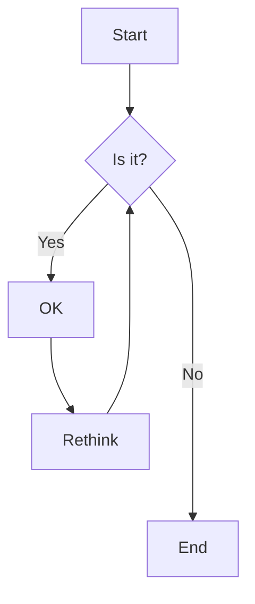
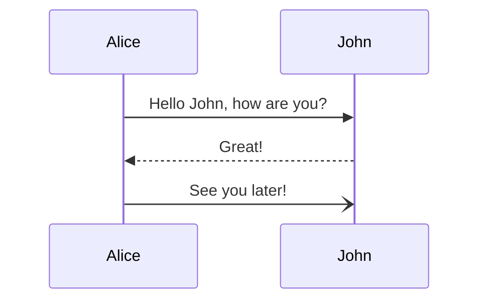
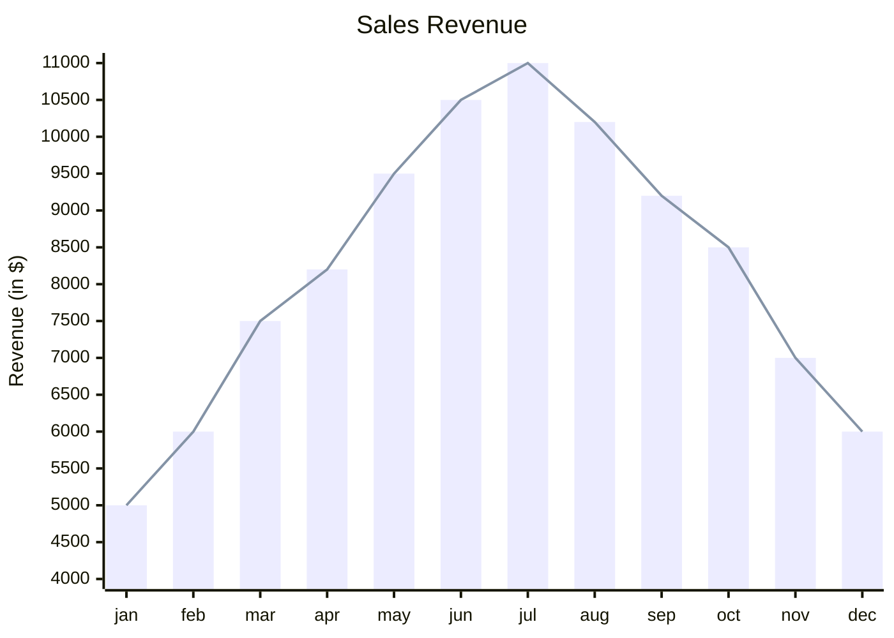

# OneLight

[TOC]

## 1 二级标题

### 1.1 三级标题

#### 1.1.1 四级标题

##### 1.1.1.1 五级标题

###### 1.1.1.1.1 六级标题

## 2 引用块

> 关关雎鸠，在河之洲。窈窕淑女，君子好逑。

## 3 GitHub警告框

> [!NOTE]
>**长风破浪会有时，直挂云帆济沧海。**——李白

> [!TIP]
>
> 春望
>
> **杜甫**〔唐代〕
>
> 国破山河在，城春草木深。
> 感时花溅泪，恨别鸟惊心。
> **烽火连三月**，家书抵万金。
> 白头搔更短，浑欲不胜簪。

> [!IMPORTANT]
>
> 问君能有几多**愁**？恰似一江春水向东流。——**李煜**《虞美人·春花秋月何时了》

> [!WARNING]
>
> 醉后不知天在水，满船清梦压星河。——**唐温如**《题龙阳县青草湖》

> [!CAUTION]
>
> 洛阳亲友如相问，一片**冰心**在玉壶。——**王昌龄**《芙蓉楼送辛渐》

## 4 代码块

```javascript
export default defineConfig({
    plugins: [
        vue(),
        AutoImport({
            resolvers: [ElementPlusResolver()],
        }),
        Components({
            resolvers: [ElementPlusResolver()],
        }),
    ],
    resolve: {
        alias: {
            '@': fileURLToPath(new URL('./src', import.meta.url))
        }
    },
    //http proxy
    server: {
        host: 'localhost',
        port: 5173,
        proxy: {
            '/api': {
                target: 'http://localhost:8080',
                changeOrigin: true,
                rewrite: (path) => path.replace(/^\/api/, '')
            }
        }
    },
})
```

## 5 列表

> 有、无序列表样式来自[dyzj](https://theme.typora.io/theme/dyzj/)主题，感谢作者muggledy

无序列表：


- 无
  - 无序
    - 无序列
      - 无序列表

有序列表：

1. 有
2. 有序
3. 有序列
4. 有序列表

任务列表：

- [x] 已完成任务
- [ ] 未完成任务

## 6 文本

| 效果                              | 语法                                | 快捷键                                             |
| --------------------------------- | ----------------------------------- | -------------------------------------------------- |
| ==文本高亮==                      | `==文本高亮==`                      | 选中文本后双击<kbd>=</kbd>键                       |
| **加粗**                          | `**加粗**`                          | 选中文本后<kbd>Ctrl B</kbd>                        |
| *斜体*                            | `*斜体*`                            | 选中文本后<kbd>Ctrl I</kbd>                        |
| ~~删除线~~                        | `~~删除线~~`                        | 选中文本后按住<kbd>Shift</kbd>然后双击<kbd>~</kbd> |
| <u>下划线</u>                     | `<u>下划线</u>`                     | 选中文本后<kbd>Ctrl U</kbd>                        |
| <kbd>Ctrl</kbd>                   | `<kbd>Ctrl</kbd>`                   | 无                                                 |
| <span alt='highlight'>高亮</span> | `<span alt='highlight'>高亮</span>` | 无                                                 |

## 7 表格

| 时间                | 人数 | 地点 |
| :------------------ | :--: | ---: |
| 2024-12-15 12:34:59 | 123  | 上海 |
| 2024-12-15 12:35:03 | 456  | 北京 |
| 2024-12-15 12:35:07 | 789  | 深圳 |

## 8 图片

图片默认居中显示，可以设置img标签的algin属性调整为左对齐或者右对齐 


` `


## 9 数学公式

- 行内公式：这是一个数学公式 $\lim\limits_{x \to \infty} \exp(-x)=0$

- 行间公式：

$$
E_0 = mc^2 \\
\quad\text{—— Albert Einstein}
$$

## 10 链接

可以直接用尖括号包裹链接`<https://clb.pages.dev>`或者使用`[链接名](链接地址)`

<https://clb.pages.dev>

[typora-onelight-theme](https://github.com/caolib/typora-onelight-theme)

## 11 音频

<audio controls="controls">
  <source src="https://bin-music.netlify.app/songs/%E5%B0%8F%E3%81%95%E3%81%AA%E6%B5%B7-%E7%B5%90%E6%9D%9F%E3%83%90%E3%83%B3%E3%83%89.mp3" type="audio/mp3" />
</audio>
## 12 mermaid

```mermaid
gantt
    dateFormat HH:mm
    axisFormat %H:%M
    Initial milestone : milestone, m1, 17:49, 2m
    Task A : 10m
    Task B : 5m
    Final milestone : milestone, m2, 18:08, 4m
```









